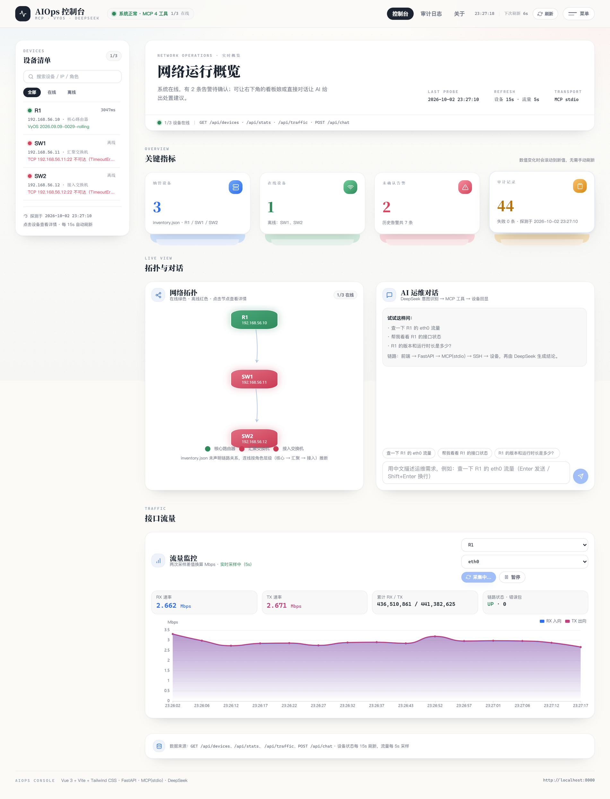
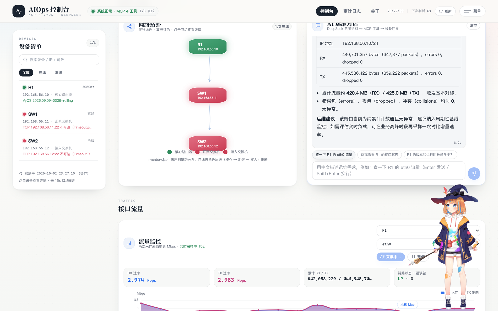
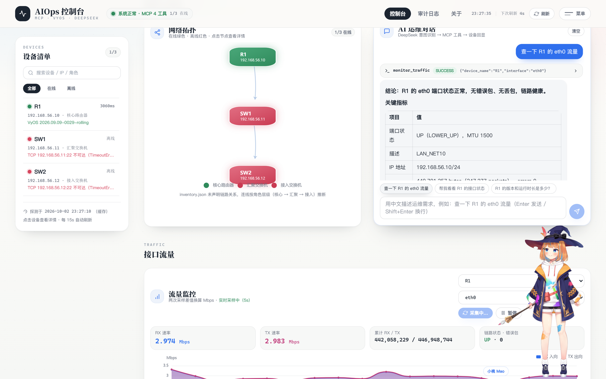
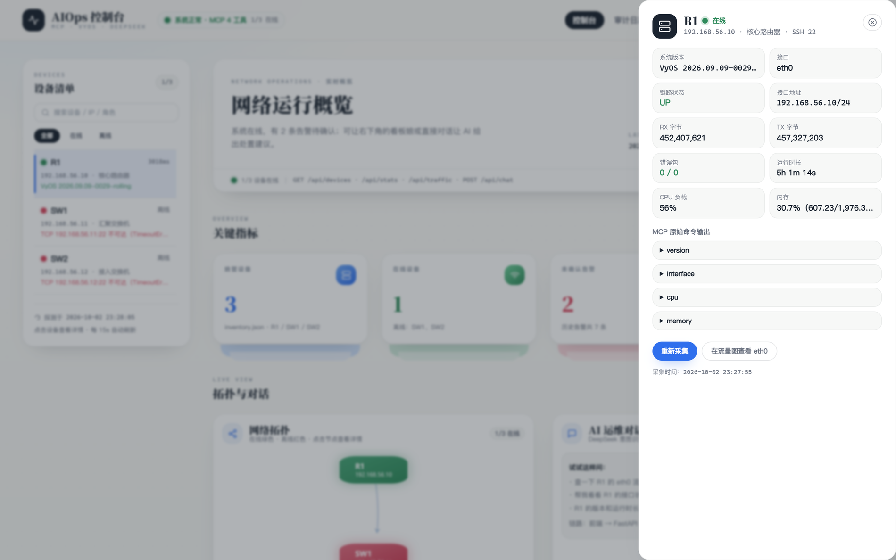
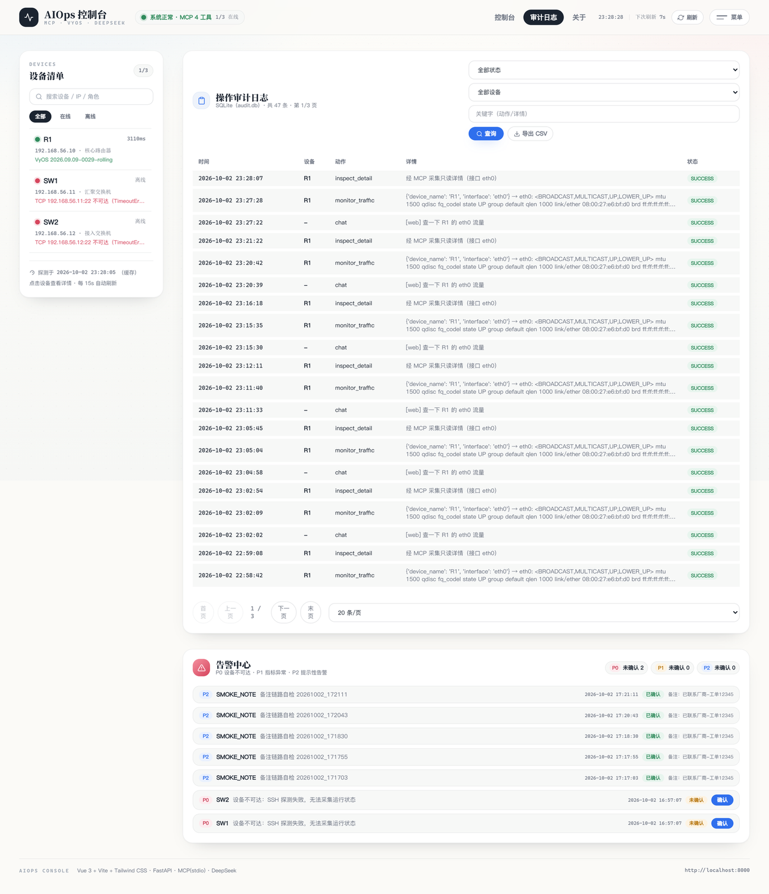
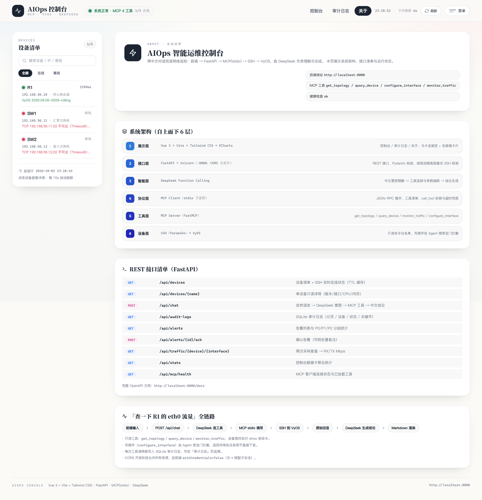
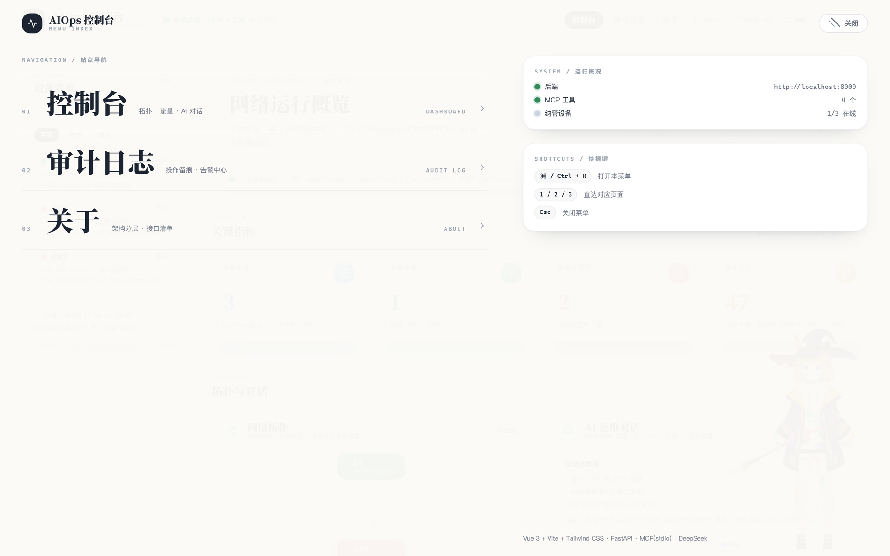

## 界面预览（2026-10-02 实拍）

> 下面 7 张图来自实验环境的**真实运行实例**：Vue3 控制台 → FastAPI → MCP（stdio）→ SSH → VyOS R1，
> 图中数据均为实测（含 SW1 / SW2 离线的告警态与真实 DeepSeek 调用结果），不含演示数据；采集方式见 [`screenshots/README.md`](screenshots/README.md)。

**01 · 控制台总览** —— 设备清单与在线状态、关键指标卡、拓扑、「AI 运维对话」、接口流量曲线（两次采样差值换算，实测 2.6 Mbps 上下）

**02 · AI 运维对话** —— 中文提问「查一下 R1 的 eth0 流量」，DeepSeek 选工具并生成结论与运维建议（耗时 8.2s）

**03 · MCP 工具调用** —— 对话里直接展开工具调用与入参（`monitor_traffic` / `SUCCESS` / `{"device_name":"R1","interface":"eth0"}`）

**04 · 设备详情抽屉** —— 版本、接口状态、CPU / 内存 / 运行时长，以及可展开的 **MCP 原始命令输出**（version / interface / cpu / memory）

**05 · 审计日志与告警中心** —— SQLite 分页审计（chat / monitor_traffic 全程留痕、支持 CSV 导出）+ P0/P1/P2 告警与确认

**06 · 关于：系统架构与接口清单** —— 六层架构（展示 / 接口 / 智能 / 协议 / 工具 / 设备）+ REST 接口清单 + 「查一下 R1 的 eth0 流量」全链路

**07 · 两横整屏菜单** —— ⌘/Ctrl+K 呼出，数字 1 / 2 / 3 直达页面、Esc 关闭

## 受管环境与真实设备适配（深度解析）

本系统并非只停留在“发送 SSH 命令”的浅层，而是针对网络操作系统的底层特性进行了深度适配。实验环境以 **VyOS（开源企业级路由操作系统）** 作为核心受管节点。

### 1. 针对 VyOS 的底层驱动适配
VyOS 的操作模式与普通 Linux 有本质区别。为了实现对真实路由器的精准控制，底层驱动（`_ssh_exec`）做了以下设计：
- **专用命令包装器**：VyOS 的 `show` 命令必须通过 `/opt/vyatta/bin/vyatta-op-cmd-wrapper` 执行，系统已自动在底层拼接该包装器，确保查询命令（如 `show version`、`show interfaces`）被正确解析。
- **配置生命周期管控**：针对写操作（如关闭端口），系统严格遵循 VyOS 的安全配置流程：自动进入 `configure` 模式 -> 执行 `set/delete` 指令 -> 自动 `commit` 提交 -> 自动 `save` 持久化。确保配置在不重启的情况下即时生效且重启后不丢失。
- **异常安全回滚**：针对 Python 3.11+ 异步框架特有的 `ExceptionGroup`（TaskGroup 异常组）导致 MCP 服务崩溃的难题，底层通过捕获 `BaseException` 并将异常转化为可读文本返回，保障了系统在面临复杂网络超时时不会整体崩溃。

### 2. 跨平台智能探测与命令翻译
为了验证系统在企业复杂环境下的横向扩展能力，底层驱动加入了**智能设备探测机制**：
- 建立 SSH 连接后，首先通过 `test -f /opt/vyatta/bin/vyatta-op-cmd-wrapper` 判断受管节点的操作系统类型。
- 若探测为 **VyOS**，则按上述原生流程执行；
- 若探测为 **Linux 容器**（如 Docker 运行的精简版 Ubuntu），则自动将 VyOS 命令翻译为 Linux 原生指令（例如将 `show interfaces ethernet eth0` 翻译为 `ip -s link show eth0` 或读取 `/proc/net/dev`）。
- 这种设计实现了“**一次开发，多厂商纳管**”的架构目标。

---

## 仓库结构（2026-10 更新）

本仓库现在是**三端一体的完整平台**，按「展示层 → 接口层 → 智能层 → 协议层 → 工具层 → 设备层」拆分：

| 目录 | 角色 | 技术栈 |
| --- | --- | --- |
| `mcp-vyos/` | 工具层 + 协议层（MCP Server）与 Streamlit 大屏 | Python · FastMCP(stdio) · Paramiko(SSH) · Streamlit + Plotly |
| `aiops-api/` | 接口层 + 智能层 | FastAPI + Uvicorn · DeepSeek Function Calling · MCP Client |
| `aiops-frontend/` | 展示层（Vue3 控制台 + Live2D 看板娘） | Vue 3 + Vite 6 + Tailwind CSS 4 + ECharts · pixi-live2d-display |

### 1. mcp-vyos —— MCP 工具服务 + Streamlit 大屏
- `server.py`：FastMCP 暴露 4 个工具 `get_topology` / `query_device` / `monitor_traffic` / `configure_interface`
- `app.py` + `ui_theme.py`：Streamlit 控制台（浅色 Glass 设计系统、Plotly 拓扑、P0/P1/P2 告警中心、SQLite 审计）
- `_ui_smoke_test.py`：UI 回归测试，`python _ui_smoke_test.py --with-devices` 会走真实 MCP + SSH 全链路

### 2. aiops-api —— REST 接口 + AI 编排（新增）
- `main.py`：`/api/devices`、`/api/stats`、`/api/chat`、`/api/audit-logs`、`/api/alerts`、`/api/traffic/...`、`/api/mcp/health`
- `agent.py`：中文意图 -> 工具选择与参数抽取 -> DeepSeek 生成中文结论
- `mcp_client.py`：MCP Client（stdio 子进程，JSON-RPC 握手 + 工具调用 + 超时兜底）
- 启动：`pip install -r requirements.txt` 后 `uvicorn main:app --reload --port 8000`；密钥放在 `.env`（模板见 `.env.example`）

### 3. aiops-frontend —— Vue3 智能运维控制台（新增，界面已重做）
- 设计语言：**和纸白 + 医用蓝**（大留白 / 纯白纸片卡片 / 衬线大标题 Noto Serif SC + Inter 正文 / 20px 圆角 / 立体层叠指标卡）
- 页面：控制台（拓扑 + 流量 + AI 对话）、审计日志（告警中心、CSV 导出）、关于（架构分层与接口清单）
- 交互：**两横菜单**（⌘/Ctrl+K 呼出、数字 1/2/3 直达、Esc 关闭）、设备搜索与状态筛选、新增告警浮层、时钟与刷新倒计时
- Live2D 陪伴型看板娘：Cubism 4 模型 **Mao（小桃）**，资源自托管于 `public/live2d/`；支持视线跟随、悬停/点击台词气泡、角色铭牌；30fps 限帧 + `pointer-events: none`，不阻塞页面交互
- 启动：`npm install` 后 `npm run dev`；`npm run build` 产出 `dist/`

### 说明
- 示例设备清单见 `mcp-vyos/inventory.json`（实验网段 `192.168.56.0/24`：核心路由 R1 + 交换机 SW1 / SW2）
- 密钥策略：Streamlit 用 `.streamlit/secrets.toml`、FastAPI 用 `.env`，二者均已写入 `.gitignore`，**不会进仓库**
- 界面截图见 `screenshots/`（2026-10-02 实验环境实拍，采集方式与数据来源见 `screenshots/README.md`）

